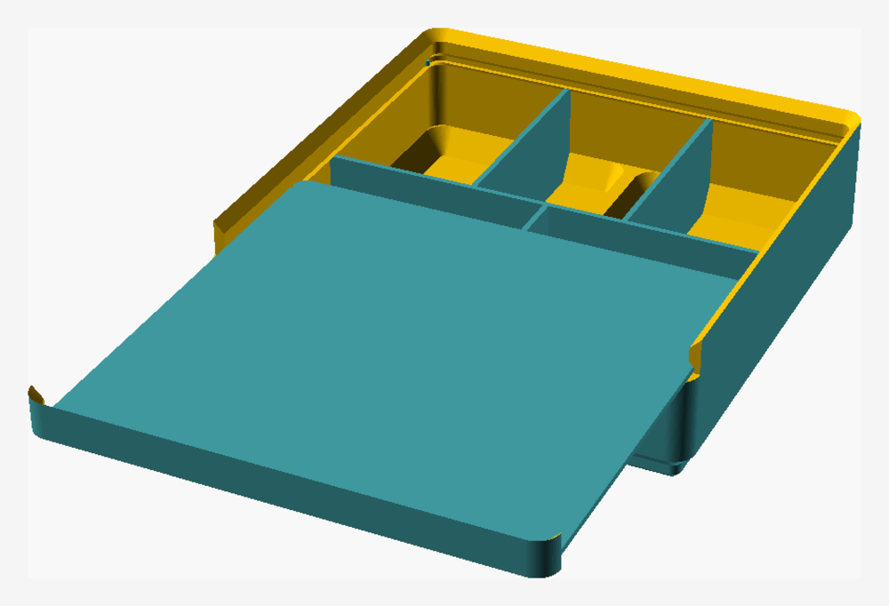
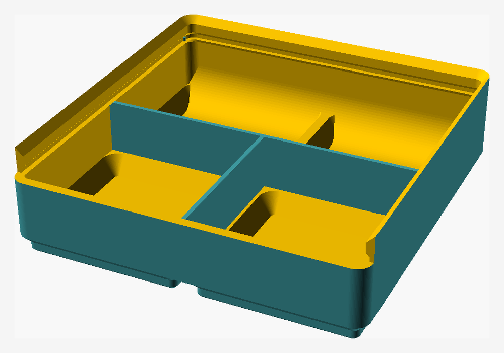
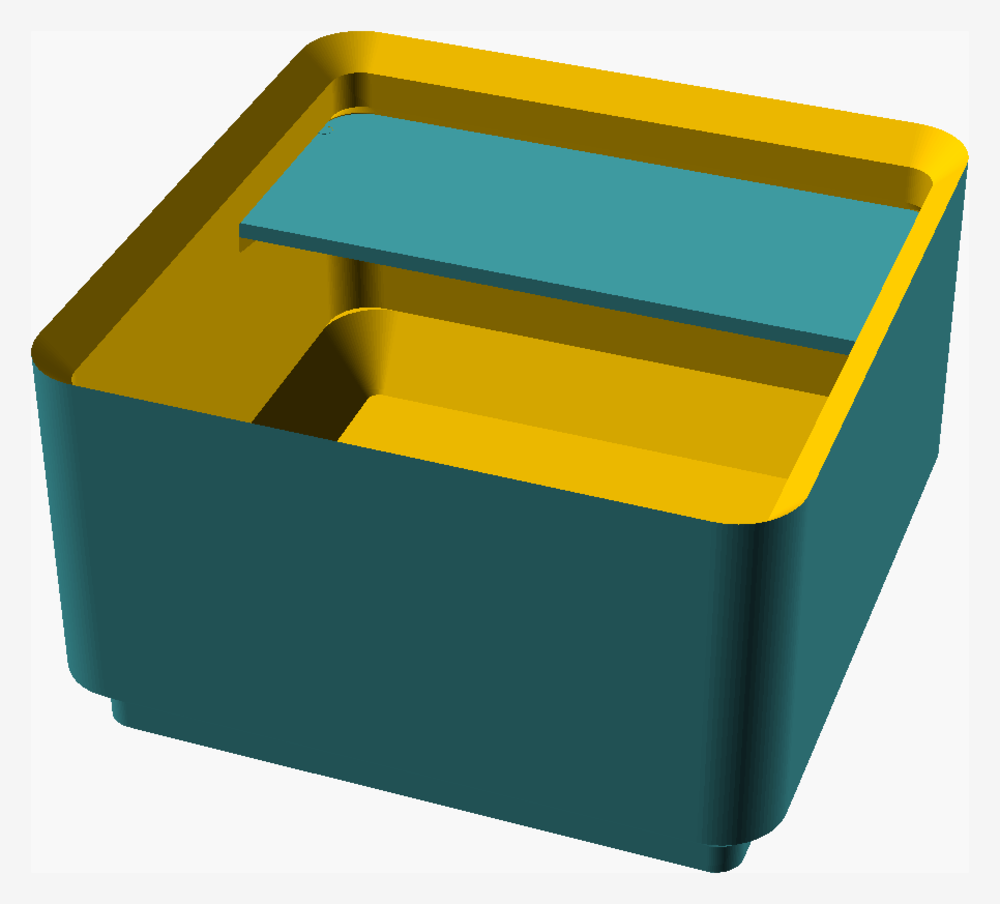
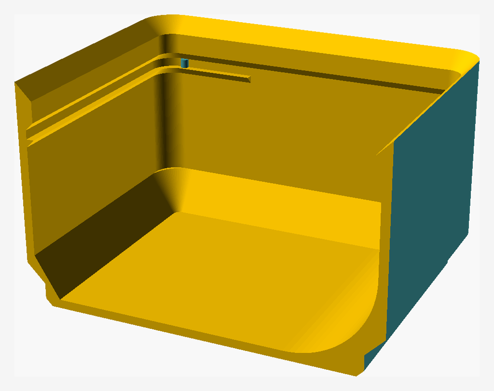

[English](README.md) · **Русский**

# gridfinity-bin

Параметрический генератор контейнеров [Gridfinity](https://gridfinity.xyz/), написанный
на OpenSCAD с нуля, без внешних библиотек.



*Бин 2x2x3 с `rows = [2, 3, 0, 0]`, крышка выдвинута наполовину. Все картинки на этой
странице отрендерены из этого же файла скриптом
[docs/render-images.sh](docs/render-images.sh).*

Проект собирает в себе три существующих модели Gridfinity — берёт особенности каждой и
переделывает их в одну параметрическую модель, управляемую Customizer'ом OpenSCAD:

- [Gridfinity Bins medium size](https://www.printables.com/model/710839-gridfinity-bins-medium-size), автор Plastic Flow
- [Gridfinity UltraLight Bins – Modular Clip-On Label System](https://www.printables.com/model/1481418-gridfinity-ultra-light-bins-modular-clip-on-label), автор Muad'Dib
- [Gridfinity inserts with cover, divided in multiple ways](https://www.printables.com/model/665798), автор mhejjas

Геометрия подгонялась под опубликованные STL обмером их сечений, а не конвертацией или
правкой сеток. Scoop, например, — вогнутая галтель радиусом 10 мм, касательная и к
внутренней передней стенке, и к полу полости; числа сняты с реального профиля ультралёгкого
бина. Там, где источники расходятся с официальными размерами Gridfinity, побеждает
спецификация: бортик под стопку сделан по ней, а не скопирован ни у одного из них.

## Что сделано

- Наружная оболочка по сетке Gridfinity (шаг 42 мм, единица высоты 7 мм) со скруглёнными
  углами. Полная высота `units_z * 7 + 4.4` мм, считая от низа ножек — ножки входят в
  единицу высоты, а не добавляются сверху
- Полость с независимой толщиной стенок и пола
- Полный профиль ножки Gridfinity (фаска 0.8 / вертикаль 1.8 / фаска 2.15 мм)
- Полые ножки: полость уходит вниз в основание, снизу остаётся только тонкая кожа — подход
  «ультралёгкий, без магнитов». Внутри ножки полость сделана одним конусом, а не копией
  ступенчатого наружного профиля: меньше пластика и ни одной горизонтальной полки-нависания
- Опциональный scoop: вогнутая галтель в углу между полом и передней стенкой, добавленная
  как материал внутрь полости, поэтому её радиус не ограничен толщиной стенки или пола
- Бортик под стопку по спецификации (0.7 / 1.8 / 1.9 мм, 4.4 мм всего). Его нижняя фаска
  выводится из толщины стенки, а не задана жёстко: спецификационные 0.7 мм подразумевают
  стенку 1.2 мм, а тонкой стенке нужен более длинный скос, иначе получится неподпёртая
  полка. С пластиной под ним скос начинается ещё ниже, так что тот же конус служит потолком
  паза
- Опциональная передняя стенка заподлицо: сторона со scoop'ом подкладывается до внутренней
  грани бортика, чтобы вычерпываемой детали ничего не мешало по пути к кромке
- Паз прямо под бортиком, в который задвигается закрывающая пластина: стенка утолщается на
  0.9 мм через 45° скос и отступает назад, и эта ступенька — полка, на которой лежит
  пластина. Сверху ничего не построено: собственный опорный конус бортика опущен на потолок
  паза, он же и держит пластину. В каждую боковую стенку утоплен круглый штифт, выступающий
  на 0.59 мм, и кромка пластины защёлкивается за него в ответную выемку
- Этим пазом пользуются две пластины, и бин сам выбирает между ними. Без перегородок это
  накладная карточка-лейбл длиной 11.95 мм. С перегородками — **задвижная крышка** на весь
  бин, потому что только крышка не даёт содержимому переходить из ячейки в ячейку. Та же
  толщина, та же полка, те же защёлки; крышка добавляет язычок, который заполняет рот и
  достраивает вырезанный кусок бортика, так что закрытый бин по-прежнему стыкуется в стопку.
  Печатается плашмя, и ни одной грани лицом вниз у неё нет
- `split_lid` режет крышку по перегородкам между ячейками, по куску на ячейку, так что
  ячейку можно открыть, не снимая крышку целиком. Каждый кусок заезжает в свою колонку через
  тот же рот и несёт свою долю язычка. Перегородка под швом становится рельсом и держит оба
  куска так же, как стенка держит их наружные кромки: 0.8 мм полки под каждой кромкой, шапка
  толщиной 0.5 мм над ней и фаски 45° на входе в обе, чтобы нависания не требовали поддержек.
  Шапка кончается вровень с крышкой, а не с бортом, и кромка под ней срезана под тем же углом,
  так что закрытая крышка выходит плоской — над ней от рельса ничего не торчит. Рельс несёт ту
  же защёлку, что и стенки, по одной в каждом из двух своих пазов, так что каждый кусок
  заскакивает за пару штифтов ровно так же, как цельная крышка за пару пристеночных. Резать
  можно только по перегородке, идущей на всю глубину бина, поэтому нужен один ряд ячеек
- Перегородки по свободной сетке: `rows` задаёт число ячеек в каждом ряду, и ряды могут
  отличаться друг от друга. Они кончаются на 0.2 мм ниже полки, чтобы крышка прошла над
  ними, и сами ничего не несут, если на них не пришёлся шов — ради этого и был сделан
  переход на крышку. Те, что делят ряды, несут на задней грани тот же scoop, что и передняя
  стенка, так что каждый ряд — маленький бин со своим scoop'ом; радиус ограничен глубиной
  ряда.
  Обмеренные сечения — в [docs/slot-profile.md](docs/slot-profile.md)

| | |
|---|---|
|  |  |
| С перегородками, крышка снята: два ряда по две и по три ячейки, у каждого ряда свой scoop от перегородки перед ним. Вырез в передней стенке — рот, через который заходит крышка. | Без перегородок, поэтому тот же паз держит карточку-лейбл 11.95 мм, а передняя стенка остаётся целой. |

## Чего ещё нет

- Отверстий под магниты и винты

## Как пользоваться

Открыть в GUI и работать через панель Customizer:

```sh
openscad gridfinity.scad
```

Отрендерить STL:

```sh
openscad -o bin.stl gridfinity.scad
```

Переопределить параметры, не трогая файл:

```sh
openscad -o bin_1x1x3.stl -D 'units_x=1' -D 'units_y=1' -D 'units_z=3' gridfinity.scad
```

## Параметры

| Параметр | По умолчанию | Диапазон | Что значит |
|---|---|---|---|
| `units_x`, `units_y` | 2 | 1–10 | Основание бина в единицах сетки 42 мм |
| `units_z` | 3 | 1–10 | Высота бина в единицах 7 мм |
| `wall_thickness` | 1 | 0.4–5 | Толщина боковых стенок |
| `floor_thickness` | 1 | 0.4–5 | Толщина плоского пола над ножками |
| `solid_foot` | false | bool | Заливать ножки целиком, вместо того чтобы каверна проваливалась в них |
| `scoop` | true | bool | Включить переднюю галтель-scoop |
| `scoop_flush` | false | bool | Подложить стенку со стороны scoop'а до внутренней грани бортика |
| `cover` | true | bool | Вырезать паз под закрывающую пластину |
| `rows` | `[1,0,0,0]` | 0–6 каждый | Число ячеек в каждом ряду, первым идёт передний; 0 убирает ряд |
| `split_lid` | false | bool | Резать крышку по куску на ячейку; нужен один ряд ячеек |
| `part` | bin | bin, card, lid, assembled | Что рендерить; `assembled` показывает бин с пластиной на месте |
| `split` | false | bool | Отладка: разрезать модель, чтобы посмотреть сечение |
| `split_axis` | x | x, y, xy | Отладка: по какой плоскости резать; `xy` оставляет четверть |

`scoop_radius` (по умолчанию 10 мм) пока лежит в скрытой группе; вынеси его из
`/* [Hidden] */`, чтобы он появился в Customizer'е.

Про `wall_thickness`: он задаёт боковые стенки, и то же значение берётся как кожа внутри
ножек. Из-за того что полость ножки — один конус, эта кожа тоньше `wall_thickness` там, где
конус проходит ближе всего к наружной поверхности: 0.69 мм при значении 1 мм по умолчанию.
Подними `wall_thickness`, если твоему соплу нужно больше.



*`split = true` разрезает модель. Здесь видно: scoop, поднимающийся по передней стенке, паз
с полкой, идущий по периметру под кромкой, и одна из двух защёлок — маленький штифт в
боковой стенке, за который заскакивает пластина.*

## Карточки и крышки

Обе генерируются тем же файлом, с теми же `units_*` и `rows`, что и бин:

```sh
openscad -o card.stl -D 'units_x=1' -D 'units_y=1' -D 'part="card"' gridfinity.scad
openscad -o lid.stl  -D 'units_x=1' -D 'units_y=1' -D 'rows=[2,3,0,0]' \
                     -D 'part="lid"' gridfinity.scad
```

Бину без перегородок нужна карточка, с перегородками — крышка. Обе привязаны к размеру бина:
карточка от 1x1 не подойдёт к 2x2. С `split_lid` крышка привязана ещё и к раскладке: выходит
по куску на ячейку. Куски уже разложены, в одной плоскости и с зазором между собой, так что
один рендер — это сразу весь комплект.

`part = "assembled"` ставит пластину туда, где она сидит в бине, и рендерит обе детали.
Нужную пластину выбирает сам. Это для того, чтобы посмотреть, а не печатать:

```sh
openscad -D 'units_x=1' -D 'units_y=1' -D 'rows=[2,3,0,0]' \
         -D 'part="assembled"' gridfinity.scad
```

Высота паза взята у карточки UltraLight Bins, снята с сетки. Глубина её канавки 2.0 мм — нет:
та модель утапливает канавку в стенку, а здесь пол паза и есть грань стенки, так что пластина
перекрывает весь проём. Толщина 0.8 мм — тоже нет: пластина 1.0 мм, потому что разница между
ней и пазом — ровно тот ход, на который пластина может всплыть, прежде чем её поймает конус
бортика. Поэтому карточка 1x1 выходит 39.1 × 11.95 × 1.0 вместо 37.4 × 11.95 × 0.8: больше
места под надпись и никакой взаимозаменяемости с карточками той модели.

Задвижная крышка, свободная сетка перегородок и круглая защёлка взяты из [Gridfinity inserts
with cover, divided in multiple ways](https://www.printables.com/model/665798), автор mhejjas,
и обмерены так же.

## Благодарности

- **Gridfinity** — система хранения, придуманная
  [Заком Фридманом](https://www.youtube.com/@ZackFreedman). Этот проект — независимая
  реализация формата, никак с ним не связанная.
- **Gridfinity Bins medium size**, автор **Plastic Flow** — лицензия CC BY 4.0 —
  <https://www.printables.com/model/710839-gridfinity-bins-medium-size>
  (сама по себе ремикс Divider Bins Зака Фридмана)
- **Gridfinity UltraLight Bins – Modular Clip-On Label System**, автор **Muad'Dib** —
  лицензия CC BY-NC-SA 4.0 —
  <https://www.printables.com/model/1481418-gridfinity-ultra-light-bins-modular-clip-on-label>
- **Gridfinity 1 x 1 x 2 and 1 x 1 x 3 inserts with cover, divided in multiple ways**, автор
  **mhejjas** — лицензия CC BY 4.0 — <https://www.printables.com/model/665798>
  (задвижная крышка, свободная сетка перегородок и круглая защёлка)

## Лицензия

**CC BY-NC-SA 4.0** — [Attribution–NonCommercial–ShareAlike 4.0 International](https://creativecommons.org/licenses/by-nc-sa/4.0/)

Выбора тут нет. Одна из трёх исходных моделей (UltraLight Bins, Muad'Dib) опубликована под
CC BY-NC-SA 4.0, чьё условие ShareAlike требует от производных работ той же лицензии, а
условие NonCommercial запрещает коммерческое использование. Две другие (обе CC BY 4.0) с
таким объединением совместимы. Значит, результат нельзя выпустить ни под чем более
свободным.

На практике это значит:

- указывать авторов выше обязательно
- никакого коммерческого использования
- ремиксы должны остаться под CC BY-NC-SA 4.0
